# ProxyForge 系统架构与实现说明

本文档描述 ProxyForge v0.3.0 的模块划分、各功能实现逻辑与流程图，便于阅读源码与二次扩展。快速上手请参阅 [README.md](../README.md)。

---

## 目录

1. [系统总览](#1-系统总览)
2. [分层架构](#2-分层架构)
3. [模块索引](#3-模块索引)
4. [代理数据模型与状态机](#4-代理数据模型与状态机)
5. [代理来源（Providers）](#5-代理来源providers)
6. [健康检测](#6-健康检测)
7. [动态评分](#7-动态评分)
8. [智能路由](#8-智能路由)
9. [租约与调度](#9-租约与调度)
10. [单 IP 限流](#10-单-ip-限流)
11. [Redis 持久化与分布式协调](#11-redis-持久化与分布式协调)
12. [ProxyPool 编排](#12-proxypool-编排)
13. [框架集成](#13-框架集成)
14. [配置系统](#14-配置系统)
15. [端到端请求生命周期](#15-端到端请求生命周期)
16. [扩展指南](#16-扩展指南)

**源码级图表（类图 + 时序图）：**

17. [ProxyPool 组合结构（类图）](#17-proxypool-组合结构类图)
18. [acquire_lease 源码时序（分布式路径）](#18-acquire_lease-源码时序分布式路径)
19. [租约子系统（类图 + 时序）](#19-租约子系统类图--时序)
20. [健康检测子系统（类图 + 时序）](#20-健康检测子系统类图--时序)
21. [评分子系统（类图 + 时序）](#21-评分子系统类图--时序)
22. [存储与持久化（类图 + 时序）](#22-存储与持久化类图--时序)
23. [Provider 子系统（类图 + 时序）](#23-provider-子系统类图--时序)
24. [Scrapy 中间件（源码时序）](#24-scrapy-中间件源码时序)
25. [httpx 客户端（源码时序）](#25-httpx-客户端源码时序)

---

## 1. 系统总览

ProxyForge 是一个**代理池管理与调度框架**。核心职责：

| 职责 | 说明 |
|------|------|
| 聚合 | 从多个 Provider 拉取代理，合并到内存池 |
| 检测 | 异步健康检查，维护 HEALTHY / UNHEALTHY / BANNED 状态 |
| 评分 | 根据成功率、延迟动态计算 score |
| 调度 | 按策略选取 IP，配合租约、限流避免冲突与封禁 |
| 持久化 | 可选 Redis 保存运行时状态，支持多机分布式 |

**入口类：** `ProxyPool`（`proxyforge/pool.py`）

**典型启动流程：**

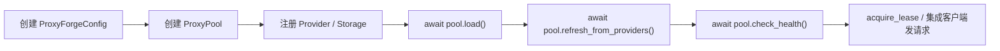
```mermaid
flowchart LR
    A[创建 ProxyForgeConfig] --> B[创建 ProxyPool]
    B --> C[注册 Provider / Storage]
    C --> D["await pool.load()"]
    D --> E["await pool.refresh_from_providers()"]
    E --> F["await pool.check_health()"]
    F --> G[acquire_lease / 集成客户端发请求]
```

---

## 2. 分层架构

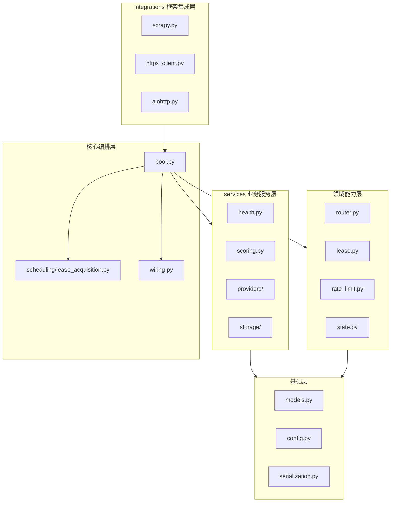
```mermaid
flowchart TB
    subgraph integrations [integrations 框架集成层]
        Scrapy[scrapy.py]
        Httpx[httpx_client.py]
        Aiohttp[aiohttp.py]
    end

    subgraph core [核心编排层]
        Pool[pool.py]
        Scheduling[scheduling/lease_acquisition.py]
        Wiring[wiring.py]
    end

    subgraph domain [领域能力层]
        Router[router.py]
        Lease[lease.py]
        RateLimit[rate_limit.py]
        State[state.py]
    end

    subgraph services [services 业务服务层]
        Health[health.py]
        Scoring[scoring.py]
        Providers[providers/]
        Storage[storage/]
    end

    subgraph foundation [基础层]
        Models[models.py]
        Config[config.py]
        Serialization[serialization.py]
    end

    integrations --> Pool
    Pool --> Scheduling
    Pool --> Wiring
    Pool --> domain
    Pool --> services
    services --> foundation
    domain --> foundation
```

**依赖方向（单向）：**

```
models / config / exceptions
    ↓
state / serialization
    ↓
services (health, scoring, providers, storage)
router / lease / rate_limit
    ↓
scheduling / wiring
    ↓
pool
    ↓
integrations / cli
```

---

## 3. 模块索引

| 路径 | 核心类/函数 | 职责 |
|------|-------------|------|
| `models.py` | `Proxy`, `ProxyStatus` | 代理实体、状态转换 |
| `config.py` | `ProxyForgeConfig` | 全局配置，支持 env/YAML/dict |
| `state.py` | `merge_provider_fields`, `merge_runtime_state` | Provider 合并 / Redis 状态同步 |
| `pool.py` | `ProxyPool` | 编排入口，对外 API |
| `router.py` | `ProxyRouter` | 筛选 + 调度策略 |
| `lease.py` | `LeaseManager`, `ProxyLease` | 进程内租约 |
| `rate_limit.py` | `ProxyRateLimiter`, `RateLimiter` | 进程内 QPS/并发限流 |
| `scheduling/lease_acquisition.py` | `LeaseAcquisitionService` | 租约获取统一编排 |
| `wiring.py` | `build_*` | 按配置装配分布式组件 |
| `services/health.py` | `HealthChecker` | 批量健康检测 |
| `services/health_urls.py` | `HealthCheckUrlResolver` | 检测 URL 解析 |
| `services/scoring.py` | `ProxyScorer` | 动态评分 |
| `services/score_window.py` | `window_stats` | 滑动窗口统计 |
| `services/providers/` | `BaseProvider`, `HttpApiProvider` | 代理来源 |
| `services/storage/` | `RedisStorage`, `PersistBuffer` 等 | 持久化与分布式协调 |

---

## 4. 代理数据模型与状态机

**实现文件：** `proxyforge/models.py`

### 4.1 关键字段

| 字段 | 用途 |
|------|------|
| `host/port/protocol` | 连接信息 |
| `status` | UNKNOWN / HEALTHY / UNHEALTHY / BANNED |
| `score` | 路由权重（0–100） |
| `success_count/failure_count` | 累计统计 |
| `consecutive_failures` | 连续失败次数，达阈值封禁 |
| `recent_events` | 滑动窗口事件 `(时间, 成功?, 延迟ms)` |
| `tags/metadata` | 标签过滤、检测 URL 覆盖 |

**唯一标识：** `proxy.key` = `{protocol}://{host}:{port}`

### 4.2 状态转换

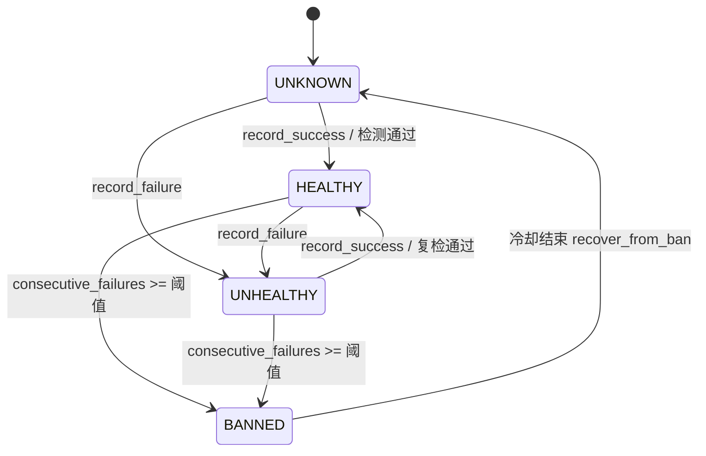
```mermaid
stateDiagram-v2
    [*] --> UNKNOWN
    UNKNOWN --> HEALTHY: record_success / 检测通过
    UNKNOWN --> UNHEALTHY: record_failure
    HEALTHY --> UNHEALTHY: record_failure
    UNHEALTHY --> HEALTHY: record_success / 复检通过
    HEALTHY --> BANNED: consecutive_failures >= 阈值
    UNHEALTHY --> BANNED: consecutive_failures >= 阈值
    BANNED --> UNKNOWN: 冷却结束 recover_from_ban
```

### 4.3 实现逻辑

**`record_success(latency_ms)`**

1. 累加成功计数与延迟
2. 重置 `consecutive_failures`
3. 设置 `status = HEALTHY`，清除 ban/unhealthy 标记
4. 追加 `recent_events` 条目（供滑动窗口评分）

**`record_failure(max_consecutive_failures)`**

1. 累加失败计数与连续失败
2. 追加失败事件到 `recent_events`
3. 若连续失败 ≥ 阈值 → `BANNED`
4. 若已是 UNHEALTHY → 增加 `unhealthy_recheck_attempts`（用于指数退避）
5. 若 HEALTHY/UNKNOWN → 首次失败变为 UNHEALTHY

**`is_available()`**（路由筛选时调用）

- BANNED：冷却期内不可用；冷却后 `recover_from_ban()` 变为 UNKNOWN
- UNHEALTHY / HEALTHY / UNKNOWN：结合 `allow_unknown_proxies` 配置决定

---

## 5. 代理来源（Providers）

**实现目录：** `proxyforge/services/providers/`

### 5.1 抽象接口

```python
class BaseProvider(ABC):
    async def fetch_proxies(self) -> list[Proxy]: ...
```

### 5.2 StaticListProvider

- 从预设 `Proxy` 列表或文本行（`host:port`）解析
- 主要用于开发、测试

### 5.3 HttpApiProvider

**流程：**

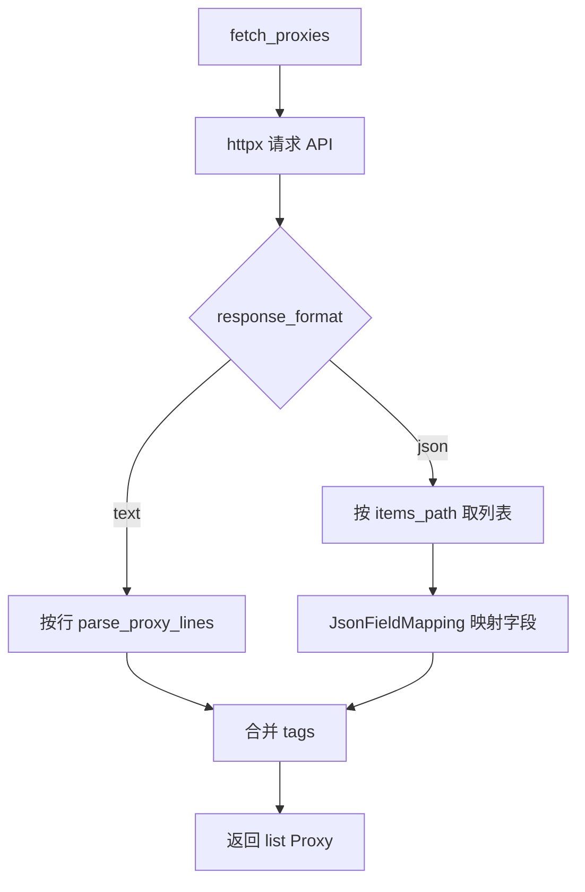
```mermaid
flowchart TD
    A[fetch_proxies] --> B[httpx 请求 API]
    B --> C{response_format}
    C -->|text| D[按行 parse_proxy_lines]
    C -->|json| E[按 items_path 取列表]
    E --> F[JsonFieldMapping 映射字段]
    D --> G[合并 tags]
    F --> G
    G --> H[返回 list Proxy]
```

**JSON 解析支持：**

- 字符串列表（每项为 URL 或 host:port）
- 对象列表（host/port/protocol 等字段）
- 单字段 `proxy` 映射（如 `"1.2.3.4:8080"`）

### 5.4 与 ProxyPool 合并

**入口：** `pool.refresh_from_providers()`

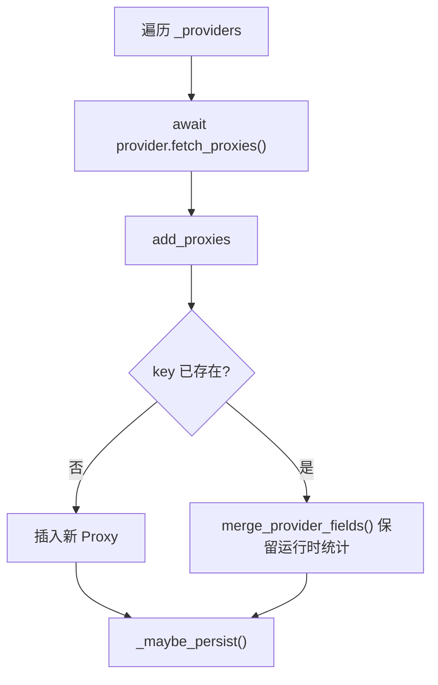
```mermaid
flowchart TD
    A[遍历 _providers] --> B["await provider.fetch_proxies()"]
    B --> C[add_proxies]
    C --> D{key 已存在?}
    D -->|否| E[插入新 Proxy]
    D -->|是| F["merge_provider_fields() 保留运行时统计"]
    E --> G["_maybe_persist()"]
    F --> G
```

**合并原则：** Provider 只更新静态字段（host/port/tags 等），不覆盖 score、status、成功/失败计数。

---

## 6. 健康检测

**实现文件：**

- `services/health.py` — `HealthChecker`
- `services/health_urls.py` — `HealthCheckUrlResolver`

### 6.1 检测 URL 解析优先级

```
task 配置 URL
  → spider 配置 URL
    → 上下文 tags
      → 代理 tags
        → proxy.metadata["health_check_url"]
          → config.health_check_url（默认）
```

### 6.2 是否需要检测（should_check）

| 状态 | 逻辑 |
|------|------|
| 从未检测 | 立即检测 |
| HEALTHY | 距上次检测 ≥ `health_check_interval` |
| UNHEALTHY | 指数退避：`base × factor^attempts`，上限 `unhealthy_check_max_interval` |
| BANNED | 冷却期内不检测；冷却后按 `banned_check_interval` 复检 |

### 6.3 批量检测流程

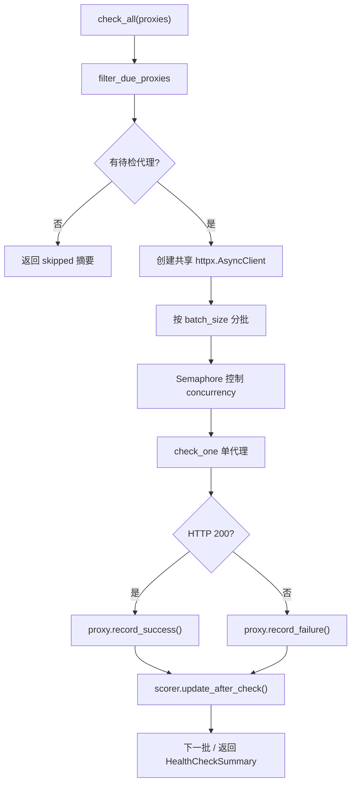
```mermaid
flowchart TD
    A["check_all(proxies)"] --> B[filter_due_proxies]
    B --> C{有待检代理?}
    C -->|否| D[返回 skipped 摘要]
    C -->|是| E[创建共享 httpx.AsyncClient]
    E --> F[按 batch_size 分批]
    F --> G[Semaphore 控制 concurrency]
    G --> H[check_one 单代理]
    H --> I{HTTP 200?}
    I -->|是| J["proxy.record_success()"]
    I -->|否| K["proxy.record_failure()"]
    J --> L["scorer.update_after_check()"]
    K --> L
    L --> M[下一批 / 返回 HealthCheckSummary]
```

**`check_one` 要点：**

- 通过代理自身 URL 发起 GET（验证代理可用性）
- 成功/失败更新 Proxy 状态并触发评分
- UNHEALTHY 代理复检成功会恢复为 HEALTHY

### 6.4 后台检测

`pool.start_background_health_check()` 创建 asyncio 循环任务，按 `health_check_interval` 周期性调用 `check_health()`。

---

## 7. 动态评分

**实现文件：**

- `services/scoring.py` — `ProxyScorer`
- `services/score_window.py` — 滑动窗口

### 7.1 评分公式

```
score = success_rate × 100 × success_rate_weight
      + latency_component × latency_weight

latency_component = max(0, 100 - avg_latency_ms / 5)
```

结果 clamp 到 [0, 100]。

### 7.2 指标来源

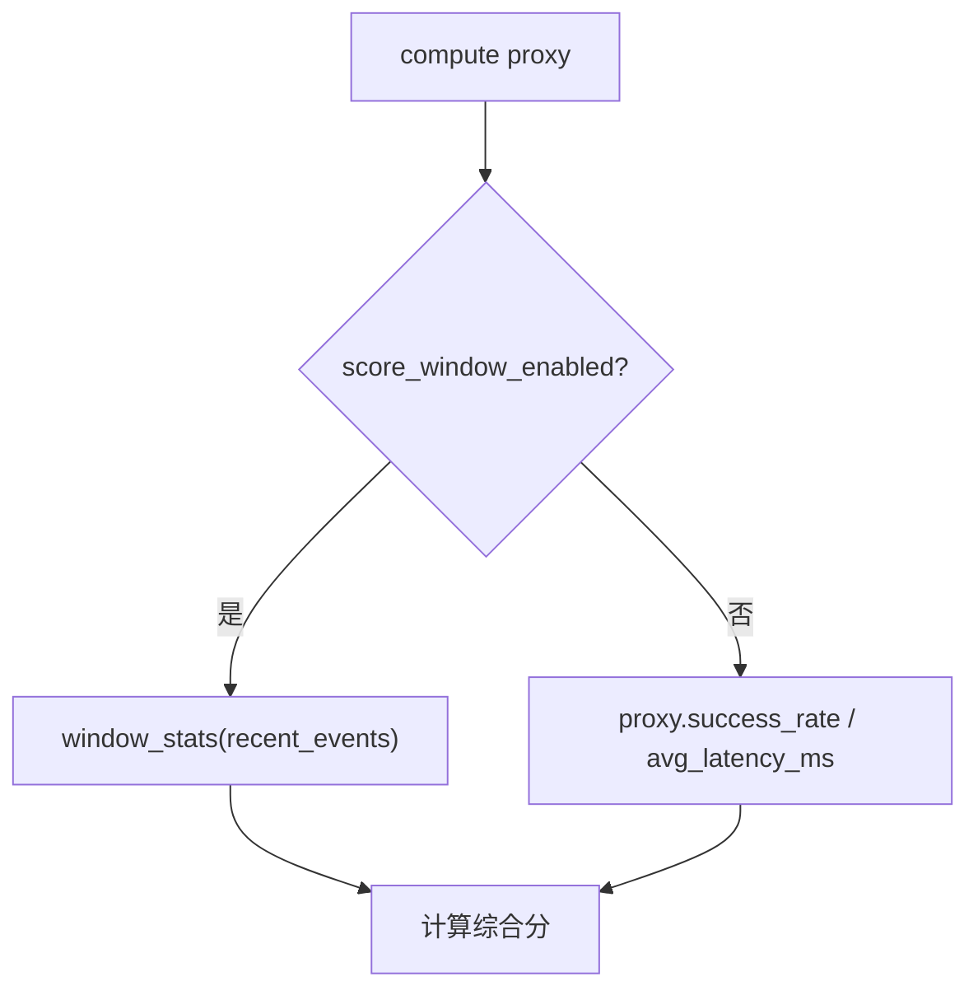
```mermaid
flowchart TD
    A[compute proxy] --> B{score_window_enabled?}
    B -->|是| C["window_stats(recent_events)"]
    B -->|否| D["proxy.success_rate / avg_latency_ms"]
    C --> E[计算综合分]
    D --> E
```

**滑动窗口：** 只保留 `score_window_seconds` 内的事件，最多 `score_window_max_events` 条。

### 7.3 更新时机

**`update_after_check(proxy, success)`** 在以下场景调用：

1. 健康检测 `check_one`
2. `pool.report_success()` / `pool.report_failure()`（业务请求反馈）

**逻辑：**

- 成功：`score += score_boost_per_success`，再 `compute()` 重算
- 失败：`score -= score_decay_per_failure`，再 `compute()` 重算

---

## 8. 智能路由

**实现文件：** `proxyforge/router.py`

### 8.1 候选筛选（filter_available）

依次过滤：

1. `exclude_keys` 排除列表
2. `proxy.is_available()` 状态与冷却
3. `score >= min_score`
4. `tags` 标签匹配（required_tags ⊆ proxy.tags）

### 8.2 调度策略

| 策略 | 方法 | 逻辑 |
|------|------|------|
| `best` | `select_best` / `iter_candidates` | 按 score 降序 |
| `weighted` | `select_weighted_random` | 以 score 为权重随机 |
| `round_robin` | `select_round_robin` | 按 key 排序后轮询 |

**`iter_candidates`** 供租约获取使用：按策略返回**有序候选列表**，逐个尝试直到成功。

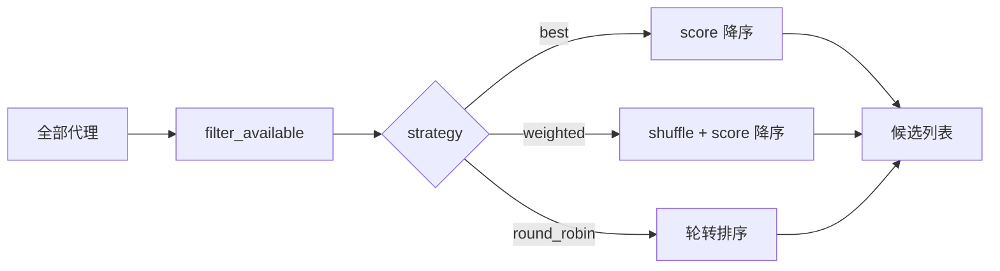
```mermaid
flowchart LR
    A[全部代理] --> B[filter_available]
    B --> C{strategy}
    C -->|best| D[score 降序]
    C -->|weighted| E[shuffle + score 降序]
    C -->|round_robin| F[轮转排序]
    D --> G[候选列表]
    E --> G
    F --> G
```

---

## 9. 租约与调度

**实现文件：**

- `lease.py` — 进程内 `LeaseManager`
- `scheduling/lease_acquisition.py` — `LeaseAcquisitionService`
- `services/storage/redis_coordinator.py` — 分布式租约

### 9.1 为什么需要租约

防止同一 IP 在并发场景下被多个任务同时使用，导致目标站异常或 IP 被封。

### 9.2 进程内租约（LeaseManager）

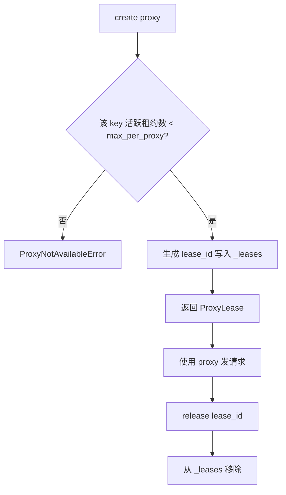
```mermaid
flowchart TD
    A[create proxy] --> B{该 key 活跃租约数 < max_per_proxy?}
    B -->|否| C[ProxyNotAvailableError]
    B -->|是| D[生成 lease_id 写入 _leases]
    D --> E[返回 ProxyLease]
    E --> F[使用 proxy 发请求]
    F --> G[release lease_id]
    G --> H[从 _leases 移除]
```

- TTL 过期：`is_expired` 为真，`cleanup_expired` 自动清理
- `get_excluded_keys()`：已达 `max_per_proxy` 的 key 不再分配

### 9.3 租约获取统一编排（LeaseAcquisitionService）

**入口：** `pool.acquire_lease()` → `LeaseAcquisitionService.acquire()`

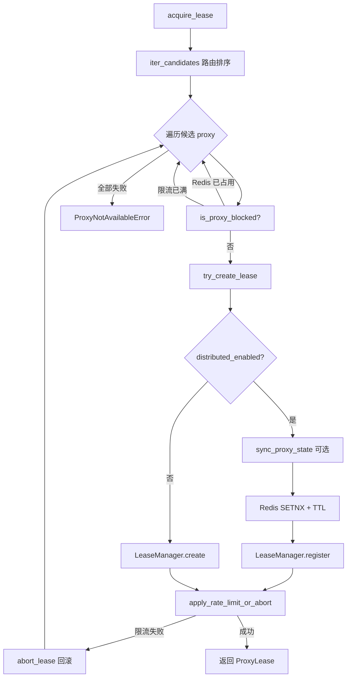
```mermaid
flowchart TD
    A[acquire_lease] --> B[iter_candidates 路由排序]
    B --> C{遍历候选 proxy}
    C --> D[is_proxy_blocked?]
    D -->|Redis 已占用| C
    D -->|限流已满| C
    D -->|否| E[try_create_lease]
    E --> F{distributed_enabled?}
    F -->|是| G[sync_proxy_state 可选]
    G --> H["Redis SETNX + TTL"]
    H --> I[LeaseManager.register]
    F -->|否| J[LeaseManager.create]
    I --> K[apply_rate_limit_or_abort]
    J --> K
    K -->|限流失败| L[abort_lease 回滚]
    L --> C
    K -->|成功| M[返回 ProxyLease]
    C -->|全部失败| N[ProxyNotAvailableError]
```

### 9.4 释放租约

**`pool.release_lease(lease)`：**

1. `release_rate_slot()` — 释放限流并发计数
2. `LeaseManager.release()` — 移除本地租约
3. `RedisLeaseCoordinator.release_lease()` — Lua 脚本安全删除 Redis 键（仅 owner 可删）

---

## 10. 单 IP 限流

**实现文件：**

- `rate_limit.py` — `ProxyRateLimiter`（进程内）
- `services/storage/redis_rate_limit.py` — `RedisRateLimiter`（分布式）

### 10.1 装配逻辑（wiring.py）

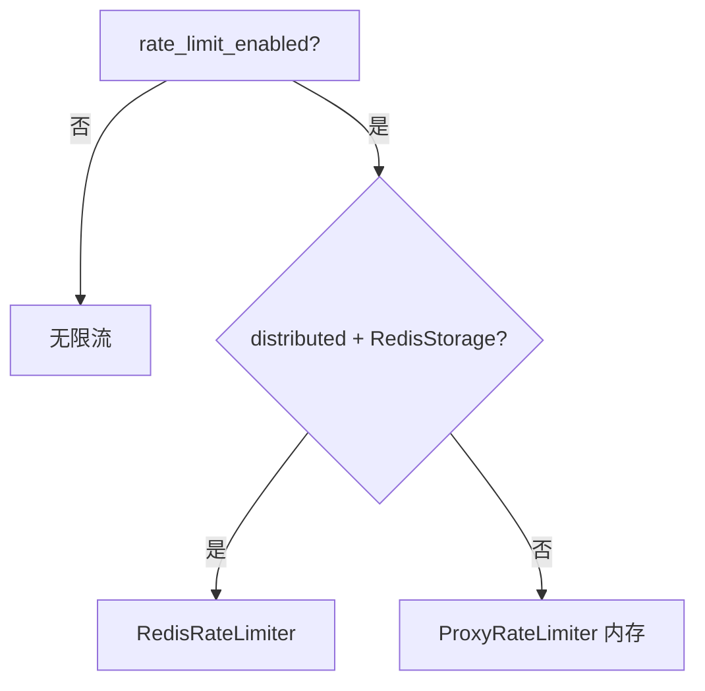
```mermaid
flowchart TD
    A[rate_limit_enabled?] -->|否| B[无限流]
    A -->|是| C{distributed + RedisStorage?}
    C -->|是| D[RedisRateLimiter]
    C -->|否| E[ProxyRateLimiter 内存]
```

### 10.2 限流维度

| 维度 | 机制 |
|------|------|
| QPS | 1 秒滑动窗口，窗口内请求数 ≥ max_qps 则拒绝 |
| 并发 | 计数器，在途请求数 ≥ max_concurrent 则拒绝 |

### 10.3 与租约的关系

- **acquire 时：** `try_acquire()` 占用 QPS 槽 + 增加并发计数（`rate_slot_held=True`）
- **release 时：** 仅释放并发计数；QPS 窗口随时间自然过期

### 10.4 Redis 分布式限流

**键：**

- `{prefix}:drqps:{proxy_key}` — Sorted Set，member=uuid，score=时间戳 ms
- `{prefix}:drconc:{proxy_key}` — 并发计数

**Lua 脚本：** 原子检查 + 写入；不支持 Lua 的环境（如 fakeredis）自动降级为 GET/ZADD 回退。

---

## 11. Redis 持久化与分布式协调

**实现目录：** `proxyforge/services/storage/`

### 11.1 RedisStorage

**键结构：**

| 键 | 内容 |
|----|------|
| `{prefix}:proxies` | Set，所有 proxy.key 索引 |
| `{prefix}:proxy:{key}` | JSON 序列化的 Proxy |

**序列化：** `serialization.proxy_to_dict` / `proxy_from_dict`

**主要操作：**

- `load_all()` / `load_proxy_sync()` — 启动恢复、分布式状态同步
- `save_proxies_batch()` — 增量保存
- `save_all()` — 全量重建索引

### 11.2 PersistBuffer（批量 flush）

**触发：** `pool` 设置 `auto_persist=True` 时，`report_success/failure` 或 health check 后标记脏数据。

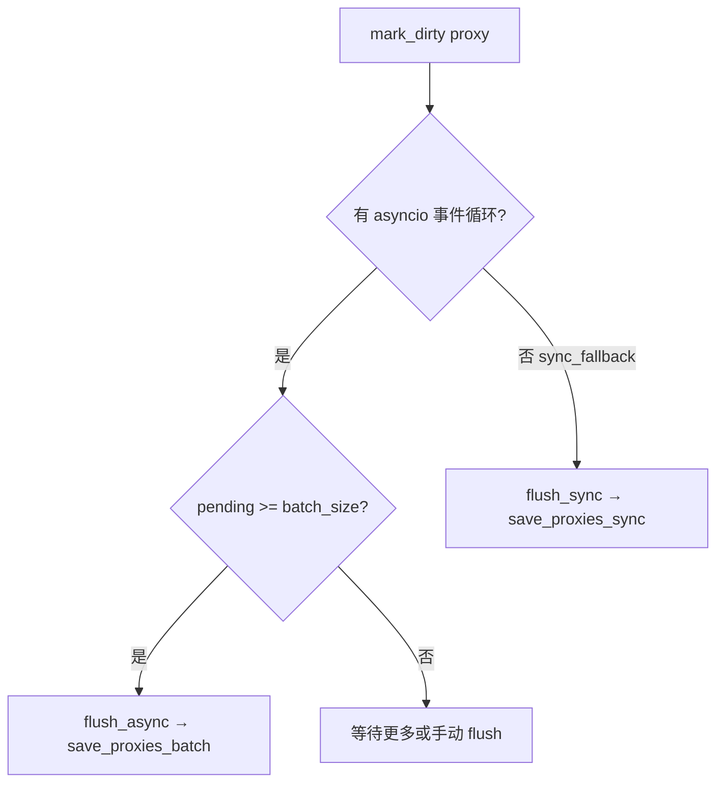
```mermaid
flowchart TD
    A[mark_dirty proxy] --> B{有 asyncio 事件循环?}
    B -->|是| C{pending >= batch_size?}
    C -->|是| D["flush_async → save_proxies_batch"]
    C -->|否| E[等待更多或手动 flush]
    B -->|否 sync_fallback| F["flush_sync → save_proxies_sync"]
```

**Scrapy 场景：** 无事件循环时走同步 Redis 写入，避免状态丢失。

### 11.3 分布式租约键

```
{prefix}:dlease:{proxy_key}:{slot}  →  lease_id (SETNX + EX ttl)
```

- `max_per_proxy` 对应 slot 数量（0, 1, …）
- `lease_id` 格式：`{instance_id}:{uuid}`

### 11.4 跨实例状态同步

**`sync_proxy_state(local)`**（acquire 前可选）：

1. `RedisStorage.load_proxy_sync(key)`
2. `merge_runtime_state(local, remote)` — 同步 score、status、统计字段

---

## 12. ProxyPool 编排

**实现文件：** `proxyforge/pool.py`

### 12.1 初始化装配

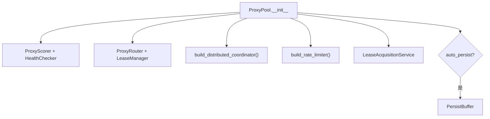
```mermaid
flowchart TD
    A[ProxyPool.__init__] --> B[ProxyScorer + HealthChecker]
    A --> C[ProxyRouter + LeaseManager]
    A --> D["build_distributed_coordinator()"]
    A --> E["build_rate_limiter()"]
    A --> F[LeaseAcquisitionService]
    A --> G{auto_persist?}
    G -->|是| H[PersistBuffer]
```

### 12.2 对外 API 一览

| 方法 | 用途 |
|------|------|
| `load()` | 从 Storage 恢复代理 |
| `refresh_from_providers()` | 拉取并合并 Provider |
| `check_health()` | 批量健康检测 |
| `acquire()` | 选取代理（无租约，不推荐生产） |
| `acquire_lease()` | 选取代理 + 租约 + 限流 |
| `release_lease()` | 释放租约与限流槽 |
| `report_success/failure()` | 业务反馈，更新评分并持久化 |
| `persist()` / `flush_persist_sync()` | 手动持久化 |
| `stats()` | 池统计摘要 |

### 12.3 线程安全

- `_sync_lock`：保护 `acquire_lease`、`release_lease`、`report_*` 等同步 API
- `_lock`（asyncio）：保护 `refresh_from_providers`

---

## 13. 框架集成

### 13.1 通用模式

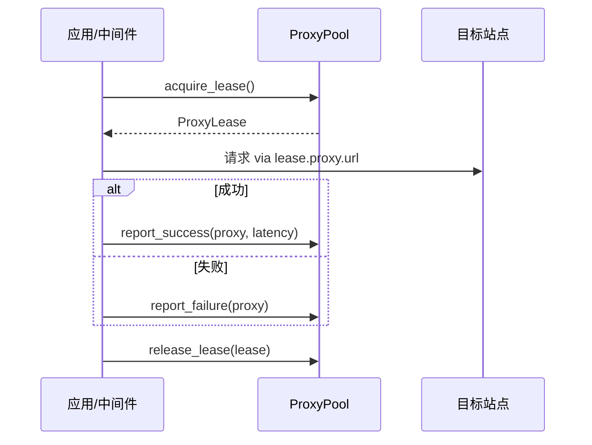
```mermaid
sequenceDiagram
    participant App as 应用/中间件
    participant Pool as ProxyPool
    participant HTTP as 目标站点

    App->>Pool: acquire_lease()
    Pool-->>App: ProxyLease
    App->>HTTP: 请求 via lease.proxy.url
    alt 成功
        App->>Pool: report_success(proxy, latency)
    else 失败
        App->>Pool: report_failure(proxy)
    end
    App->>Pool: release_lease(lease)
```

### 13.2 httpx / aiohttp 客户端

**文件：** `integrations/httpx_client.py`, `integrations/aiohttp.py`

**逻辑：**

1. 循环 `max_retries + 1` 次
2. `acquire_lease(exclude_keys=tried)`
3. 发 HTTP 请求
4. 若状态码 ∈ `retry_http_codes` 或网络异常 → `report_failure`，加入 tried，换 IP 重试
5. 成功 → `report_success`
6. `finally: release_lease`

### 13.3 Scrapy 中间件

**文件：** `integrations/scrapy.py`

**`process_request`：**

- 若无租约 meta → `acquire_lease(exclude_keys=tried)`
- 设置 `request.meta["proxy"]` 与租约 meta

**`process_response` / `process_exception`：**

- 成功 → `report_success`
- 403/429/5xx → `report_failure`，递增 retry count，重调度请求换 IP
- 始终 `release_lease`

---

## 14. 配置系统

**实现文件：** `proxyforge/config.py`

### 14.1 加载方式

| 方式 | 用法 |
|------|------|
| 代码 | `ProxyForgeConfig(...)` |
| 环境变量 | `ProxyForgeConfig.from_env()`，前缀 `PROXYFORGE_` |
| YAML | `ProxyForgeConfig.from_yaml("config.yaml")` |

### 14.2 配置分组

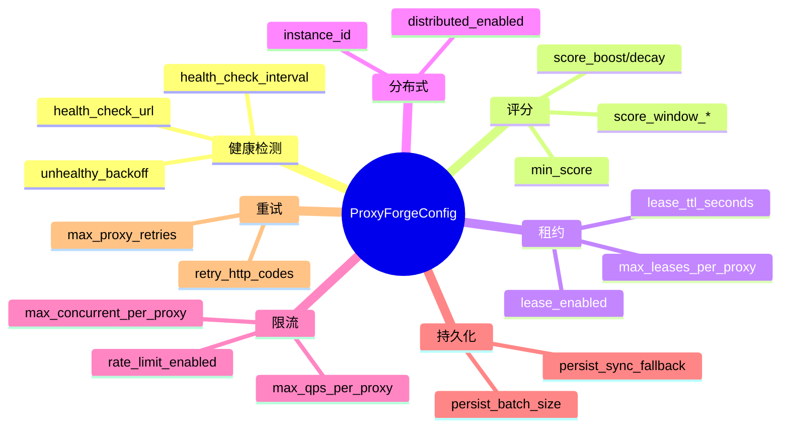
```mermaid
mindmap
  root((ProxyForgeConfig))
    健康检测
      health_check_url
      health_check_interval
      unhealthy_backoff
    评分
      min_score
      score_window_*
      score_boost/decay
    租约
      lease_enabled
      lease_ttl_seconds
      max_leases_per_proxy
    分布式
      distributed_enabled
      instance_id
    限流
      rate_limit_enabled
      max_qps_per_proxy
      max_concurrent_per_proxy
    持久化
      persist_batch_size
      persist_sync_fallback
    重试
      max_proxy_retries
      retry_http_codes
```

---

## 15. 端到端请求生命周期

以 **多机 + Redis + httpx 集成** 为例：

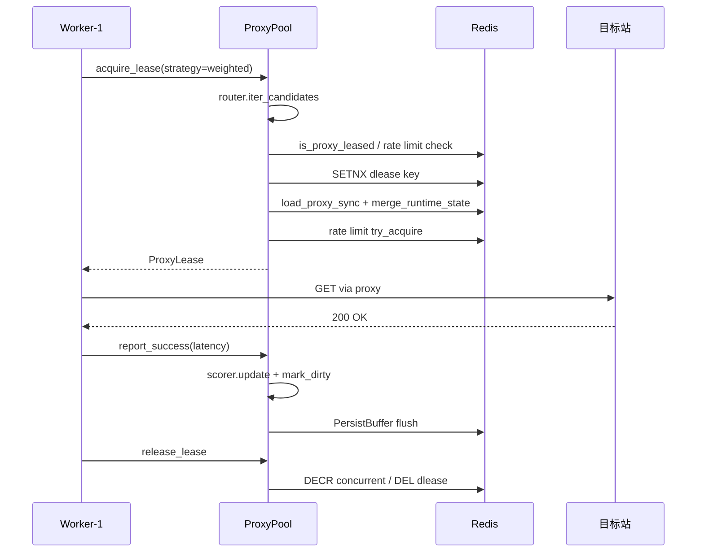
```mermaid
sequenceDiagram
    participant W1 as Worker-1
    participant Pool as ProxyPool
    participant Redis as Redis
    participant Site as 目标站

    W1->>Pool: acquire_lease(strategy=weighted)
    Pool->>Pool: router.iter_candidates
    Pool->>Redis: is_proxy_leased / rate limit check
    Pool->>Redis: SETNX dlease key
    Pool->>Redis: load_proxy_sync + merge_runtime_state
    Pool->>Redis: rate limit try_acquire
    Pool-->>W1: ProxyLease

    W1->>Site: GET via proxy
    Site-->>W1: 200 OK

    W1->>Pool: report_success(latency)
    Pool->>Pool: scorer.update + mark_dirty
    Pool->>Redis: PersistBuffer flush

    W1->>Pool: release_lease
    Pool->>Redis: DECR concurrent / DEL dlease
```

---

## 16. 扩展指南

| 需求 | 扩展点 | 参考 |
|------|--------|------|
| 新代理来源 | 继承 `services.providers.BaseProvider` | `http_api.py` |
| 新存储后端 | 继承 `services.storage.BaseStorage` | `redis.py` |
| 自定义限流 | 实现 `RateLimiter` 协议，注入 `ProxyPool(rate_limiter=...)` | `rate_limit.py` |
| 自定义分布式租约 | 注入 `ProxyPool(distributed=...)` | `redis_coordinator.py` |
| 新 HTTP 框架 | 复制 httpx 集成的 acquire→request→release 模式 | `httpx_client.py` |

**建议阅读顺序（源码）：**

1. `models.py` → 理解 Proxy 状态
2. `pool.py` → 对外 API
3. `scheduling/lease_acquisition.py` → 调度核心
4. `services/health.py` + `services/scoring.py` → 检测与评分
5. `services/storage/` → 持久化与分布式
6. `integrations/` → 业务接入方式

---

## 17. ProxyPool 组合结构（类图）

`ProxyPool` 是**编排者（Facade）**，自身不实现检测/路由/租约细节，而是组合各子系统并在 `_sync_lock` 下暴露 API。

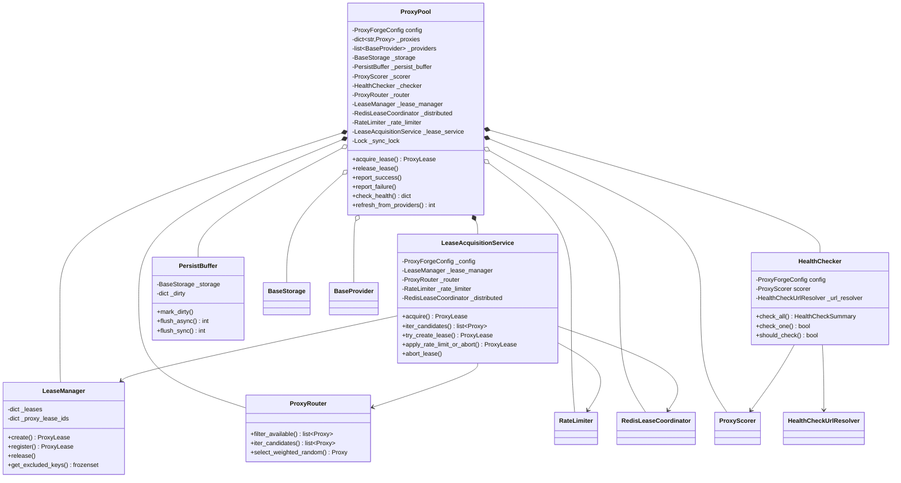
```mermaid
classDiagram
    class ProxyPool {
        -ProxyForgeConfig config
        -dict~str,Proxy~ _proxies
        -list~BaseProvider~ _providers
        -BaseStorage _storage
        -PersistBuffer _persist_buffer
        -ProxyScorer _scorer
        -HealthChecker _checker
        -ProxyRouter _router
        -LeaseManager _lease_manager
        -RedisLeaseCoordinator _distributed
        -RateLimiter _rate_limiter
        -LeaseAcquisitionService _lease_service
        -Lock _sync_lock
        +acquire_lease() ProxyLease
        +release_lease()
        +report_success()
        +report_failure()
        +check_health() dict
        +refresh_from_providers() int
    }

    class LeaseAcquisitionService {
        -ProxyForgeConfig _config
        -LeaseManager _lease_manager
        -ProxyRouter _router
        -RateLimiter _rate_limiter
        -RedisLeaseCoordinator _distributed
        +acquire() ProxyLease
        +iter_candidates() list~Proxy~
        +try_create_lease() ProxyLease
        +apply_rate_limit_or_abort() ProxyLease
        +abort_lease()
    }

    class HealthChecker {
        -ProxyForgeConfig config
        -ProxyScorer scorer
        -HealthCheckUrlResolver _url_resolver
        +check_all() HealthCheckSummary
        +check_one() bool
        +should_check() bool
    }

    class ProxyRouter {
        +filter_available() list~Proxy~
        +iter_candidates() list~Proxy~
        +select_weighted_random() Proxy
    }

    class LeaseManager {
        -dict _leases
        -dict _proxy_lease_ids
        +create() ProxyLease
        +register() ProxyLease
        +release()
        +get_excluded_keys() frozenset
    }

    class PersistBuffer {
        -BaseStorage _storage
        -dict _dirty
        +mark_dirty()
        +flush_async() int
        +flush_sync() int
    }

    ProxyPool *-- LeaseAcquisitionService
    ProxyPool *-- HealthChecker
    ProxyPool *-- ProxyRouter
    ProxyPool *-- LeaseManager
    ProxyPool *-- ProxyScorer
    ProxyPool o-- PersistBuffer
    ProxyPool o-- RedisLeaseCoordinator
    ProxyPool o-- RateLimiter
    ProxyPool o-- BaseStorage
    ProxyPool o-- BaseProvider

    LeaseAcquisitionService --> LeaseManager
    LeaseAcquisitionService --> ProxyRouter
    LeaseAcquisitionService --> RateLimiter
    LeaseAcquisitionService --> RedisLeaseCoordinator

    HealthChecker --> ProxyScorer
    HealthChecker --> HealthCheckUrlResolver
```

**装配入口（`ProxyPool.__init__`）：**

| 字段 | 创建方式 |
|------|----------|
| `_scorer` | `ProxyScorer(config)` |
| `_checker` | `HealthChecker(config, _scorer)` |
| `_router` | `ProxyRouter(config)` |
| `_lease_manager` | `LeaseManager(ttl, max_per_proxy)` |
| `_distributed` | `build_distributed_coordinator(config, storage)` 或注入 |
| `_rate_limiter` | `build_rate_limiter(config, storage)` 或注入 |
| `_lease_service` | `LeaseAcquisitionService(...)` |
| `_persist_buffer` | `auto_persist` 时 `PersistBuffer(storage, ...)` |

---

## 18. acquire_lease 源码时序（分布式路径）

对应调用链：`ProxyPool.acquire_lease` → `LeaseAcquisitionService.acquire`（持有 `_sync_lock`）。

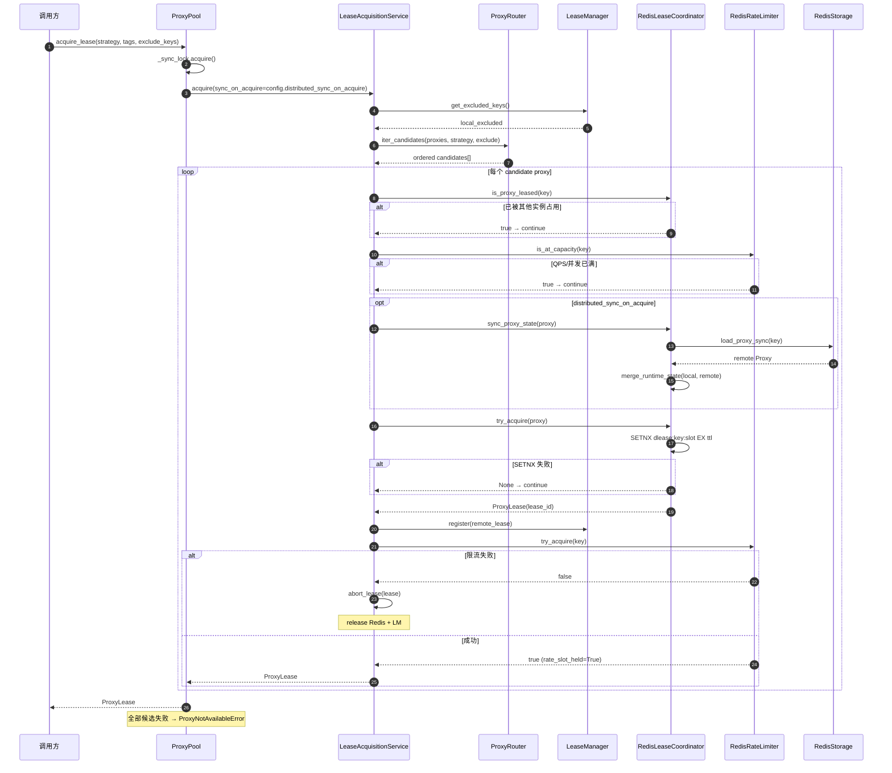
```mermaid
sequenceDiagram
    autonumber
    participant Client as 调用方
    participant Pool as ProxyPool
    participant Svc as LeaseAcquisitionService
    participant Router as ProxyRouter
    participant LM as LeaseManager
    participant Redis as RedisLeaseCoordinator
    participant RL as RedisRateLimiter
    participant Storage as RedisStorage

    Client->>Pool: acquire_lease(strategy, tags, exclude_keys)
    Pool->>Pool: _sync_lock.acquire()
    Pool->>Svc: acquire(sync_on_acquire=config.distributed_sync_on_acquire)

    Svc->>LM: get_excluded_keys()
    LM-->>Svc: local_excluded
    Svc->>Router: iter_candidates(proxies, strategy, exclude)
    Router-->>Svc: ordered candidates[]

    loop 每个 candidate proxy
        Svc->>Redis: is_proxy_leased(key)
        alt 已被其他实例占用
            Redis-->>Svc: true → continue
        end
        Svc->>RL: is_at_capacity(key)
        alt QPS/并发已满
            RL-->>Svc: true → continue
        end

        opt distributed_sync_on_acquire
            Svc->>Redis: sync_proxy_state(proxy)
            Redis->>Storage: load_proxy_sync(key)
            Storage-->>Redis: remote Proxy
            Redis->>Redis: merge_runtime_state(local, remote)
        end

        Svc->>Redis: try_acquire(proxy)
        Redis->>Redis: SETNX dlease:key:slot EX ttl
        alt SETNX 失败
            Redis-->>Svc: None → continue
        end
        Redis-->>Svc: ProxyLease(lease_id)

        Svc->>LM: register(remote_lease)

        Svc->>RL: try_acquire(key)
        alt 限流失败
            RL-->>Svc: false
            Svc->>Svc: abort_lease(lease)
            Note over Svc: release Redis + LM
        else 成功
            RL-->>Svc: true (rate_slot_held=True)
            Svc-->>Pool: ProxyLease
        end
    end

    Pool-->>Client: ProxyLease
    Note over Pool: 全部候选失败 → ProxyNotAvailableError
```

**本地路径差异：** 无 Redis 步骤，`try_create_lease` 直接调用 `LeaseManager.create(proxy)`。

---

## 19. 租约子系统（类图 + 时序）

### 19.1 类图

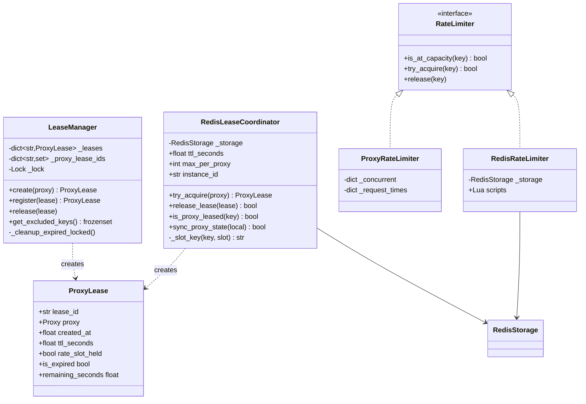
```mermaid
classDiagram
    class ProxyLease {
        +str lease_id
        +Proxy proxy
        +float created_at
        +float ttl_seconds
        +bool rate_slot_held
        +is_expired bool
        +remaining_seconds float
    }

    class LeaseManager {
        -dict~str,ProxyLease~ _leases
        -dict~str,set~ _proxy_lease_ids
        -Lock _lock
        +create(proxy) ProxyLease
        +register(lease) ProxyLease
        +release(lease)
        +get_excluded_keys() frozenset
        -_cleanup_expired_locked()
    }

    class RedisLeaseCoordinator {
        -RedisStorage _storage
        +float ttl_seconds
        +int max_per_proxy
        +str instance_id
        +try_acquire(proxy) ProxyLease
        +release_lease(lease) bool
        +is_proxy_leased(key) bool
        +sync_proxy_state(local) bool
        -_slot_key(key, slot) str
    }

    class RateLimiter {
        <<interface>>
        +is_at_capacity(key) bool
        +try_acquire(key) bool
        +release(key)
    }

    class ProxyRateLimiter {
        -dict _concurrent
        -dict _request_times
    }

    class RedisRateLimiter {
        -RedisStorage _storage
        +Lua scripts
    }

    LeaseManager ..> ProxyLease : creates
    RedisLeaseCoordinator ..> ProxyLease : creates
    RateLimiter <|.. ProxyRateLimiter
    RateLimiter <|.. RedisRateLimiter
    RedisLeaseCoordinator --> RedisStorage
    RedisRateLimiter --> RedisStorage
```

### 19.2 release_lease 时序

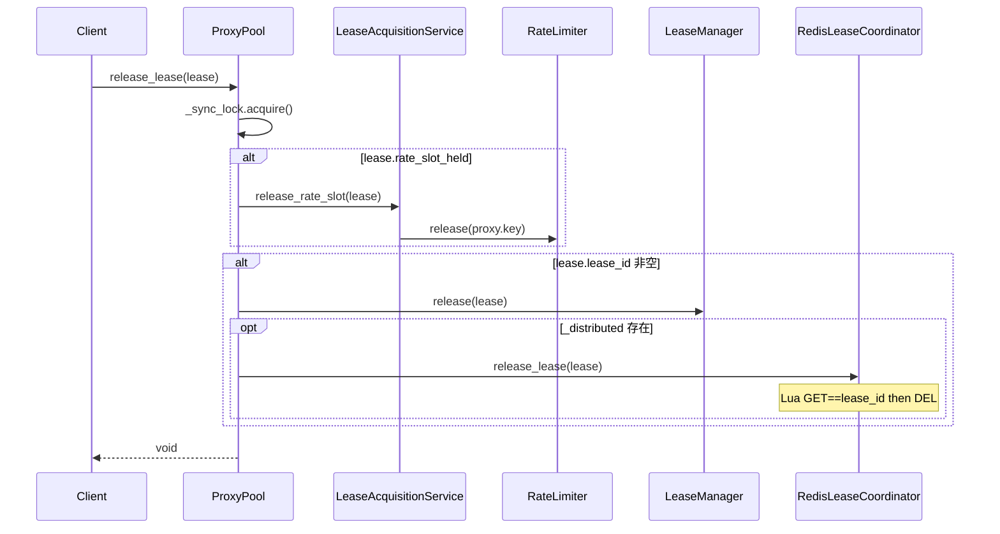
```mermaid
sequenceDiagram
    participant Client
    participant Pool as ProxyPool
    participant Svc as LeaseAcquisitionService
    participant RL as RateLimiter
    participant LM as LeaseManager
    participant Redis as RedisLeaseCoordinator

    Client->>Pool: release_lease(lease)
    Pool->>Pool: _sync_lock.acquire()

    alt lease.rate_slot_held
        Pool->>Svc: release_rate_slot(lease)
        Svc->>RL: release(proxy.key)
    end

    alt lease.lease_id 非空
        Pool->>LM: release(lease)
        opt _distributed 存在
            Pool->>Redis: release_lease(lease)
            Note over Redis: Lua GET==lease_id then DEL
        end
    end

    Pool-->>Client: void
```

---

## 20. 健康检测子系统（类图 + 时序）

### 20.1 类图

```mermaid
classDiagram
    class HealthChecker {
        +ProxyForgeConfig config
        +ProxyScorer scorer
        -HealthCheckUrlResolver _url_resolver
        +check_all(proxies) HealthCheckSummary
        +check_one(proxy, client) bool
        +should_check(proxy) bool
        +filter_due_proxies() tuple
        +unhealthy_recheck_delay(proxy) float
        +resolve_url(proxy, context) str
    }

    class HealthCheckUrlResolver {
        +ProxyForgeConfig config
        +resolve(proxy, context) str
    }

    class HealthCheckContext {
        +str task
        +str spider
        +frozenset tags
    }

    class HealthCheckSummary {
        +int checked
        +int skipped
        +int passed
        +int failed
        +dict results
    }

    class ProxyScorer {
        +update_after_check(proxy, success)
        +compute(proxy) float
    }

    class Proxy {
        +record_success(latency_ms)
        +record_failure()
    }

    HealthChecker *-- HealthCheckUrlResolver
    HealthChecker --> ProxyScorer
    HealthChecker ..> HealthCheckContext
    HealthChecker ..> HealthCheckSummary
    HealthChecker ..> Proxy : mutates
    HealthCheckUrlResolver ..> HealthCheckContext
```

### 20.2 check_one 时序

```mermaid
sequenceDiagram
    participant HC as HealthChecker
    participant Resolver as HealthCheckUrlResolver
    participant Proxy as Proxy
    participant HTTP as httpx.AsyncClient
    participant Scorer as ProxyScorer

    HC->>Resolver: resolve(proxy, context)
    Resolver-->>HC: check_url

    HC->>HTTP: GET check_url via proxy.url
    alt HTTP 200
        HTTP-->>HC: response
        HC->>Proxy: record_success(latency_ms)
        Note over Proxy: status=HEALTHY, recent_events+=
    else 异常或非 200
        HTTP-->>HC: error / non-200
        HC->>Proxy: record_failure(max_consecutive_failures)
        Note over Proxy: 可能 UNHEALTHY / BANNED
    end

    HC->>Scorer: update_after_check(proxy, ok)
    Scorer->>Scorer: boost/decay + compute()
    HC-->>HC: return ok
```

### 20.3 check_all 批量时序

```mermaid
sequenceDiagram
    participant Pool as ProxyPool
    participant HC as HealthChecker
    participant HTTP as httpx.AsyncClient

    Pool->>HC: check_all(_proxies.values())
    HC->>HC: filter_due_proxies(force?)
    HC->>HTTP: AsyncClient(limits, timeout)

    loop 每 batch_size 条
        par Semaphore(concurrency)
            HC->>HC: check_one(p1)
            HC->>HC: check_one(p2)
        end
    end

    HC-->>Pool: HealthCheckSummary
    Pool->>Pool: _maybe_persist()
```

---

## 21. 评分子系统（类图 + 时序）

### 21.1 类图

```mermaid
classDiagram
    class ProxyScorer {
        +ProxyForgeConfig config
        -_resolve_metrics(proxy) tuple
        +compute(proxy) float
        +update_after_check(proxy, success)
    }

    class WindowStats {
        +float success_rate
        +float avg_latency_ms
        +int sample_count
    }

    class Proxy {
        +float score
        +list~tuple~ recent_events
        +int success_count
        +int failure_count
        +success_rate float
        +avg_latency_ms float
    }

    namespace score_window {
        class window_stats {
            <<function>>
        }
        class prune_score_events {
            <<function>>
        }
        class append_score_event {
            <<function>>
        }
    }

    ProxyScorer ..> window_stats : uses if score_window_enabled
    window_stats ..> WindowStats
    window_stats ..> Proxy : reads recent_events
    ProxyScorer ..> Proxy : reads/writes score
```

### 21.2 update_after_check 时序

```mermaid
sequenceDiagram
    participant Caller as Pool / HealthChecker
    participant Scorer as ProxyScorer
    participant Proxy as Proxy
    participant WS as window_stats

    Caller->>Scorer: update_after_check(proxy, success)

    alt success == True
        Scorer->>Proxy: score += score_boost_per_success
    else success == False
        Scorer->>Proxy: score -= score_decay_per_failure
    end

    Scorer->>Scorer: compute(proxy)

    alt score_window_enabled
        Scorer->>WS: window_stats(proxy, window_seconds, max_events)
        WS->>WS: prune_score_events()
        WS-->>Scorer: WindowStats | None
        Note over Scorer: success_rate, avg_latency from window
    else
        Note over Scorer: 使用 proxy 累计 success_rate / avg_latency
    end

    Scorer->>Proxy: score = clamp(raw, 0, 100)
```

---

## 22. 存储与持久化（类图 + 时序）

### 22.1 类图

```mermaid
classDiagram
    class BaseStorage {
        <<abstract>>
        +save_proxy(proxy)*
        +save_proxies_batch(proxies)*
        +save_all(proxies)*
        +load_all()* list~Proxy~
        +supports_sync() bool
        +save_proxies_sync(proxies)
    }

    class RedisStorage {
        +str url
        +str key_prefix
        +load_proxy_sync(key) Proxy
        +sync_client Redis
        +close()
    }

    class PersistBuffer {
        -BaseStorage _storage
        -dict~str,Proxy~ _dirty
        +mark_dirty(proxy)
        +flush_async() int
        +flush_sync() int
    }

    class RedisLeaseCoordinator {
        +try_acquire(proxy)
        +release_lease(lease)
    }

    class RedisRateLimiter {
        +try_acquire(key)
        +release(key)
    }

    BaseStorage <|-- RedisStorage
    PersistBuffer --> BaseStorage
    RedisLeaseCoordinator --> RedisStorage
    RedisRateLimiter --> RedisStorage

    namespace serialization {
        class proxy_to_dict {
            <<function>>
        }
        class proxy_from_dict {
            <<function>>
        }
    }

    RedisStorage ..> proxy_to_dict
    RedisStorage ..> proxy_from_dict
```

**Redis 键空间：**

| 键模式 | 用途 |
|--------|------|
| `{prefix}:proxies` | Set，代理 key 索引 |
| `{prefix}:proxy:{key}` | String，JSON 序列化 Proxy |
| `{prefix}:dlease:{key}:{slot}` | String，分布式租约 |
| `{prefix}:drqps:{key}` | ZSet，QPS 滑动窗口 |
| `{prefix}:drconc:{key}` | String，并发计数 |

### 22.2 report_success → 持久化时序

```mermaid
sequenceDiagram
    participant Client
    participant Pool as ProxyPool
    participant Proxy as Proxy
    participant Scorer as ProxyScorer
    participant Buf as PersistBuffer
    participant Storage as RedisStorage

    Client->>Pool: report_success(proxy, latency_ms)
    Pool->>Pool: _sync_lock.acquire()
    Pool->>Proxy: record_success(latency_ms)
    Pool->>Scorer: update_after_check(proxy, True)
    Pool->>Pool: _schedule_persist(proxy)

    alt auto_persist && _persist_buffer
        Pool->>Buf: mark_dirty(proxy)
        alt pending >= batch_size 或有事件循环
            Buf->>Buf: flush_async / flush_sync
            Buf->>Storage: save_proxies_batch(batch)
        end
    else auto_persist && 无 buffer
        Pool->>Storage: create_task save_proxy(proxy)
    end
```

---

## 23. Provider 子系统（类图 + 时序）

### 23.1 类图

```mermaid
classDiagram
    class BaseProvider {
        <<abstract>>
        +str name
        +fetch_proxies()* list~Proxy~
    }

    class StaticListProvider {
        -list~Proxy~ _proxies
        +fetch_proxies() list~Proxy~
    }

    class HttpApiProvider {
        +str url
        +str method
        +JsonFieldMapping field_mapping
        +fetch_proxies() list~Proxy~
        -_parse_json(payload) list~Proxy~
    }

    class JsonFieldMapping {
        +str host
        +str port
        +str protocol
        +str proxy
    }

    class parse_proxy_lines {
        <<function>>
    }

    BaseProvider <|-- StaticListProvider
    BaseProvider <|-- HttpApiProvider
    HttpApiProvider --> JsonFieldMapping
    HttpApiProvider ..> parse_proxy_lines
    StaticListProvider ..> parse_proxy_lines
```

### 23.2 refresh_from_providers 时序

```mermaid
sequenceDiagram
    participant Pool as ProxyPool
    participant Provider as HttpApiProvider
    participant HTTP as httpx.AsyncClient
    participant State as merge_provider_fields

    Pool->>Pool: async with _lock
    loop 每个 provider
        Pool->>Provider: fetch_proxies()
        Provider->>HTTP: request(api_url)
        HTTP-->>Provider: JSON / text
        Provider->>Provider: _parse_json / parse_proxy_lines
        Provider-->>Pool: list~Proxy~

        loop 每个 proxy
            Pool->>Pool: add_proxy(proxy)
            alt key 不存在
                Pool->>Pool: _proxies[key] = proxy
            else key 已存在
                Pool->>State: merge_provider_fields(existing, incoming)
                Note over State: 保留 score/status/统计
            end
        end
    end

    Pool->>Pool: _maybe_persist()
```

---

## 24. Scrapy 中间件（源码时序）

**类：** `integrations.scrapy.ProxyForgeMiddleware`

```mermaid
sequenceDiagram
    participant Scrapy as Scrapy Engine
    participant MW as ProxyForgeMiddleware
    participant Pool as ProxyPool
    participant Site as 目标站

    Scrapy->>MW: process_request(request)
    alt 已有 LEASE_META_KEY
        MW-->>Scrapy: return
    end
    MW->>Pool: acquire_lease(exclude_keys=tried)
    Pool-->>MW: ProxyLease
    MW->>MW: _bind_proxy(request, lease)
    Note over MW: meta: proxy, lease, download_slot

    Scrapy->>Site: download via proxy
    Site-->>Scrapy: response

    Scrapy->>MW: process_response(request, response)

    alt status in retry_http_codes && retry_count < max
        MW->>Pool: report_failure(proxy)
        MW->>Pool: release_lease(lease)
        MW->>MW: _retry_with_new_proxy(request)
        Note over MW: copy request, tried+=key, retry_count++
        MW-->>Scrapy: new_request (重调度)
    else 正常完成
        alt 200 <= status < 400
            MW->>Pool: report_success(proxy, latency)
        else
            MW->>Pool: report_failure(proxy)
        end
        MW->>Pool: release_lease(lease)
        MW-->>Scrapy: response
    end

    opt 网络异常 process_exception
        MW->>Pool: report_failure + release 或 _retry_with_new_proxy
    end
```

---

## 25. httpx 客户端（源码时序）

**类：** `integrations.httpx_client.ProxyForgeHttpxClient`

```mermaid
sequenceDiagram
    participant App as 应用代码
    participant Client as ProxyForgeHttpxClient
    participant Pool as ProxyPool
    participant HTTP as httpx.AsyncClient
    participant Site as 目标站

    App->>Client: request(method, url)

    loop attempt in 0..max_retries
        Client->>Pool: acquire_lease(exclude_keys=tried)
        Pool-->>Client: ProxyLease

        Client->>HTTP: request(url, proxy=lease.proxy.url)
        alt HTTPError / OSError
            HTTP-->>Client: exception
            Client->>Pool: report_failure(proxy)
            Client->>Pool: release_lease(lease)
            Client->>Client: tried.add(key)
        else 得到 response
            HTTP-->>Client: response
            alt status in retry_http_codes
                Client->>Pool: report_failure(proxy)
                Client->>Client: tried.add(key), continue
            else 2xx/3xx
                Client->>Pool: report_success(proxy, latency_ms)
                Client-->>App: response
            end
            Client->>Pool: release_lease(lease)
        end
    end

    alt 全部重试失败
        Client-->>App: raise last_exc / HTTPError
    end
```

**与 Scrapy 的差异：** httpx 客户端在**同一协程**内循环重试；Scrapy 通过返回 `new_request` 交给引擎重新调度。

---

*文档版本：与 ProxyForge v0.3.0 源码同步。*

